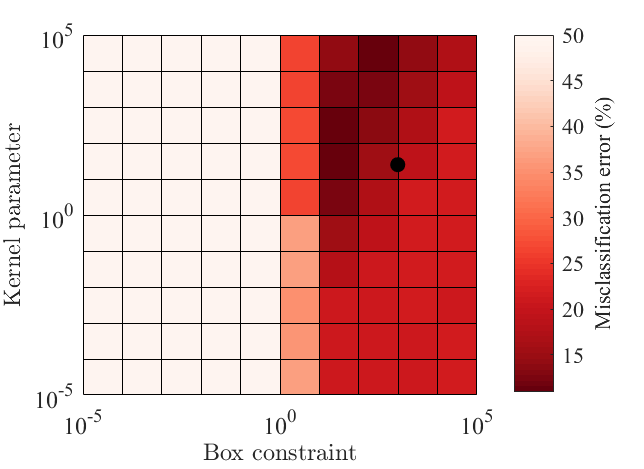

# Binary classification of diatom chains

This repo contains functions used for training and testing of the binary SVM
classifier, and the trained SVM classifier itself. The classifier was used for detecting
diatom chains from other particles and organisms imaged _in situ_ by the Scripps Plankton
Camera (http://spc.ucsd.edu/). More information on the performance and the
output of the classifier can be found in the following publication:

Kenitz, K. M., E. C. Orenstein, P. L. D. Roberts, P. J. S. Franks, J. S. Jaffe,
M. L. Carter, and A. D. Barton. 2020. Environmental drivers of population
variability in colony-forming marine diatoms. Limnol. Oceanogr. 65: 2515–2528.
doi:10.1002/lno.11468

## SVM classifier
`SVMmodel_fitSVMposterior_EQ.mat`

## Functions for classifier training and testing

### Finding SVM parameters

`error=find_SVM_params_loop(X_train,Y_train, box_vector, sigma_vector)`

> Reports classifier misclassification error for the range of values of box constraint (`box_vector`) and kernel scale (`sigma_vector`) specified by the user. `X_train` is a matrix of feature values for the training set and `Y_train` is a corresponding binary target vector.

`[box_opt, sigma_opt]=find_SVM_params_optimize(X_train,Y_train)`
> Finds optimal values for box constraint (`box_opt`) and kernel scale (`sigma_opt`) using optimization.`X_train` is a matrix of feature values for the training set and `Y_train` is a corresponding binary target vector.  

`fig=generate_fig_SVM_params(error, box_vector, sigma_vector, box_opt, sigma_opt)`
> Generates a figure mapping the misclassification error (`error`) for a range of box constraint (`box_vector`) and kernel scale (`sigma_vector`) values specified by the user in the `find_SVM_params_loop()`, and marks the optimal values for box constraint (`box_opt`) and kernel scale (`sigma_opt`) estimated in `find_SVM_params_optimize()`. Example figure:

### Classifier accuracy on testing set

`[Y_test_true, Y_test_predicted] = SVM_crossval_accuracy_iter(X_all, Y_all, DATA_SPLIT, iter, box_opt, sigma_opt)`
> Trains and applies a classifier to randomly generated training and test set by splitting all available data (numerical features `X_all` and target vector `Y_all`). `DATA_SPLIT` specified the proportion of all data that will form the training set. Parameter `iter` specifies the number of iterations where a different training and test sets are randomly sampled for each iteration. The SVM classifier is trained with box constraint (`box_opt`) and kernel scale (`sigma_opt`) specified by the user. The function outputs an _n_ by _iter_ matrix of true test classifications (`Y_test_true`) and _n_ by _iter_ matrix of corresponding predicted classifications (`Y_test_predicted`).

## SVM training

`ScoreSVMModel=train_SVM_classifier(X_train, Y_train, box_constraint, kernel_scale)`
> Trains a SVM classifier (`ScoreSVMModel`) using box constraint (`box_constraint`) and kernel scale (`kernel_scale`) specified by the user. `X_train` is a numerical matrix of feature values for the training set and `Y_train` is a corresponding binary target vector. Generated SVM classifier will output probability for each classification (and not the score) once applied to the target data.

## SVM application to training data

`SVM_output=apply_SVM_classifier(ScoreSVMModel,target_data)`

> Applies the SVM classifier (`ScoreSVMModel`) to the target data (`target_data`). `target_data` is a cell matrix where `target_data(:,1)` contains image IDs, and `target_data(:,2:end)` contains numerical features used for classification.
